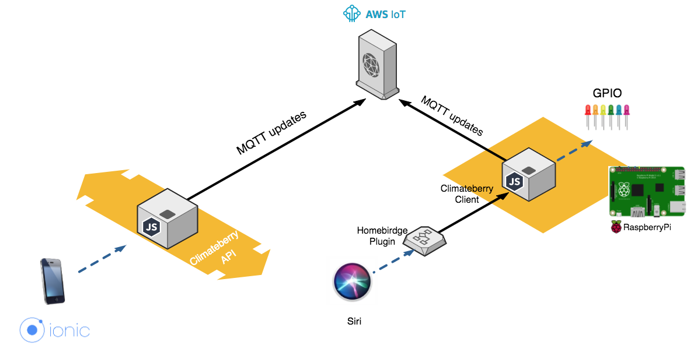
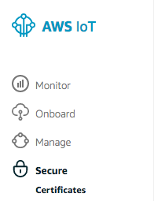

# Climateberry

Aplicación para controlar la temperatura a través de la Raspberry Pi

[](https://david-dm.org/francisco-navarro/climateberry)

[](https://codeclimate.com/github/francisco-navarro/climateberry/maintainability)

## Esquema




### Ejecutar servidor:


```bash
$ npm start
```


### Ejecutar cliente:


```bash
$ npm start client
```

Puede haber problemas si no se ejecuta como administrador con los puertos GPIO. Referencia para abrir los puertos GPIO por consola: http://www.raspberry-projects.com/pi/command-line/io-pins-command-line/io-pin-control-from-the-command-line


## API

* ### Login

` POST api/login `

Devuelve el status code correcto o error

* ### Temperatura

Para obtener la temperatura

` GET api/temperature `

```javascript
{
  unit: 'C',
  actual: 23.5,
  desired: 23.5
}
```

Para modificar la temperatura

` PUT api/temperature `

```javascript
{
  desired: 23.5
}
```

Para obtener histórico de temperatura

` GET api/temperature?history `

```javascript
[
  {
    unit: 'C',
    date: 43543252352,
    actual: 23.5,
    desired: 23.5
  }
]
```

## Plugin para homebridge

Integración para homebridge (interactua con homekit usando esta librería: https://github.com/nfarina/homebridge). Para que sea compatible con homebridge hay que instalar

``` bash
npm install -g homebridge-climateberry-plugin
```

Y luego añadir la configuración del accesorio en el config.json

```javascript
        {
            "accessory": "Climateberry",
	          "name": "Climateberry 1",
            "getUrl": "http://HOST/api/status",
            "postUrl": "http://HOST/api/order"
      }
``` 

## Integración con IoT


### Azure

Para poder ejecutarlo correctamente con el hub IoT de Azure, hay que configurar las siguientes variables de entorno:
* IOT_REGISTRY_KEY - Clave con permisos de escritura en el registro, para registar un nuevo dispositivo
* IOT_DEVICE_KEY - Clave con permiso de conexión de dispositivo. 

Más información: https://docs.microsoft.com/es-es/azure/iot-hub/iot-hub-node-node-getstarted

### AWS IoT

Instalar certificados con install-certs.sh y adjuntar en la ruta certs/ los certificados bajados de la web de aws.



